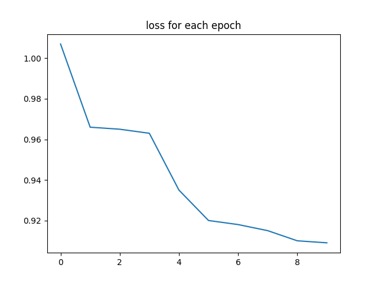
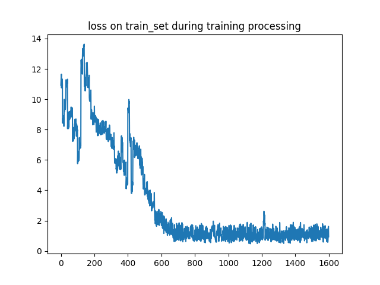
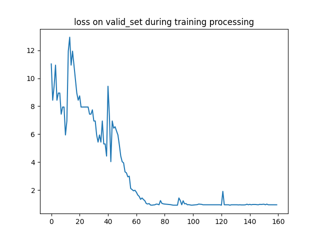
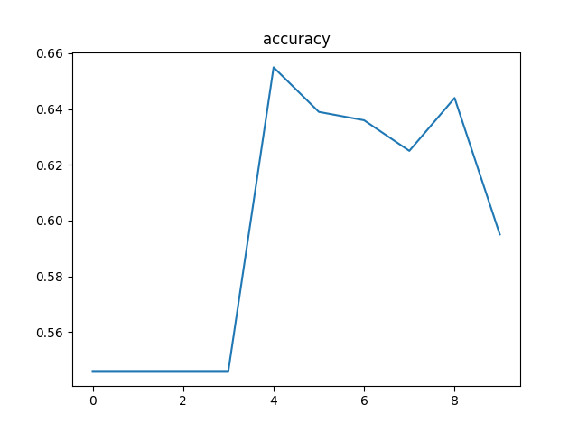

# 当代人工智能课程实验项目五

### 多模态融合的情感分析模型

---

### 姓名：杨舜
### 学号：10205501415
---
# 0.项目结构

```
└─lab5
    ├─data  // 存放数据集数据，因为数据集较大，没有上传到GitHub上，需要下载数据集并解压缩到该目录下
    │
    ├─model
    |     BertModel.py
    |     ResNet50.py
    |     Mymodel.py
    |
    |-saveModel  //保存训练好的模型
    |     dev_model.pt
    |
    |-Config
    |     config.py  // 该项目模型的一些参数设置
    |
    |-tool //搭建模型用到的一些子定义工具类
    |     DataLoader.py // 数据载入工具
    |     MyDataset.py  // 继承DataSet的自定义数据集
    |     Train.py      // 模型训练工具
    |
    |-test_pred.csv //对实验所给数据的测试集的预测结果
    |     
    |-DataLog  // 存放训练过程种产生的数据
    |
    |—figout  // 模型的训练结果展示图
    |      
    ├─main.py // 模型入口
    |
    |-aftertrain.py  // 用于完成训练之后对于损失值，验证集准确率等数据进行统计和可视化展示
    |
    |—requirement.txt // 该项目需要的一些外部包
    |
```


# 实验环境

- CPU: Intel(R) Core i5 12490F
- GPU: RTX 2060 SUPER
- CUDA : V11.8.89
- 操作系统： Windows11

利用main.py作为项目入口根据参数输入启动model（ResNet50+BERT）模型进行训练和预测

接下来介绍如何运行使用该项目

---

# 1.安装第三方包依赖

该项目需要的第三方包都存放在了requirements.txt文件中，可以通过下面的命令来进行安装
```shell
pip install -r requirements.txt
```
完成环境依赖安装后便可以运行训练该模型或者使用训练好的模型进行预测

# 2.数据集预处理

在github并没有包括本次实验需要的数据集./data/目录下为空，需要将本次实验需要的数据集压缩包街道到该项目的./data/目录才可以进行后续实验。

另外为了实验的方便，本人已经编写了一个简单的脚本来将text数据和img数据进行区分，放到不同的文件夹中

在本项目的根目录下有脚本文件[img_txt.py](./img_txt.py),在根目录下运行如下命令后进行划分（这一步是必须的）

```shell
python img_txt.py
```

区分前的目录结构为

```
└─data
   |--data
   |    1.jpg
   |    1.txt
   |    ......
   |
   |-test_without_label.txt
   |-train.txt
```

区分后的目录结构为

```
└─data
   |--data
   |    |--img
   |    |    1.jpg
   |    |    ......
   |    |
   |    |--text
   |         1.txt
   |         ......
   |    
   |-test_without_label.txt
   |-train.txt
```

# 3.训练模型
在项目的根目录下可以利用下列的命令启动训练对应的模型并进行预测
启动模型的可输入参数包括

```txt
--mode ：模型启动方式（train or test）。default='train'
--lr ：模型学习率。default=3e-3
--epoch ： 训练迭代次数.default=10

## 消融实验使用参数
--text_only ：只输入text
--img_only ：只输入img
```

启动训练模型的命令可以使用

```shell
python main.py --mode train --epoch 20 --lr 0.0001
```

应为需要下载预选训练模型，所以在初次运行这条命令可能会报错，只要多运行两次即可。

通过上述命令即可得到训练好的模型，模型将保存到[./saveModel](./saveModel/dev_model.pt)

# 4.预测数据

预测数据的过程将利用已经训练好的模型对于所给[测试文件](./data/test_without_label.txt)进行预测,并将预测结果保存到./data/test_with_label.txt

```shell
python main.py --mode test
```

# 5.训练中间过程数据可视化

```shell
python after_train.py
```

运行这段命令可以将训练过程中的损失值变化，验证集准确率变化进行可视化展示，同时将图片保存到项目的figout文件夹中

本次实验取epoch为10，每个epoch下验证集和测试集预测准确率的变换图以及损失函数变化图

训练过程中每个epoch上损失值的变化为



训练过程中总体损失值的变化为



训练过程中验证集上的损失值的变化为



训练过程中验证集上的准确率变化为的变化为



# 6.消融实验

在本次实验中采取的是将文本输入和图像输入进行交叉注意力融合的方式训练模型，对于已经训练好的模型可以利用如下命令进行单文本输入验证和单图像输入验证

```shell
# 单文本输入
python main.py --text_only
```

```shell
python main.py --img_only
```

对于只输入文本或只输入图片的预测结果如下：

||img_only|text_only|
|---|---|---|
|val_acc|0.61|0.73|


# 7. 注意点

在本次实验中对于文本输入的处理利用了[bert-base-cased](https://huggingface.co/bert-base-cased/tree/main)模型，在开发实验中本人已经将模型下载到本地利用AutoModel进行模型的载入，但是如果你从本仓库克隆项目到本地之后在进行运行时，AutoModel会将[bert-base-cased](https://huggingface.co/bert-base-cased/tree/main)模型进行下载之后才会进行后续的本人搭建模型的训练，当然，消融测试和预测文本将会读取已经训练好的模型进行实验则不需要再下载[bert-base-cased](https://huggingface.co/bert-base-cased/tree/main)模型。